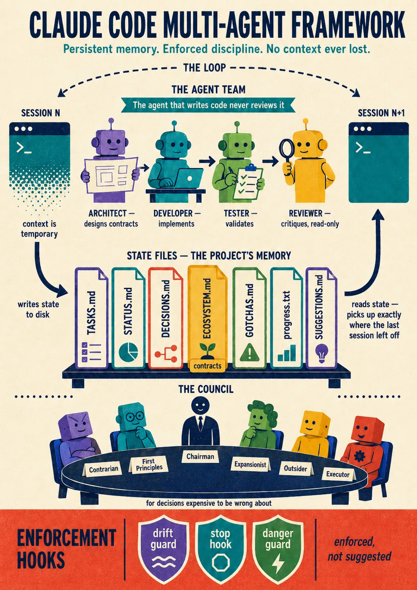
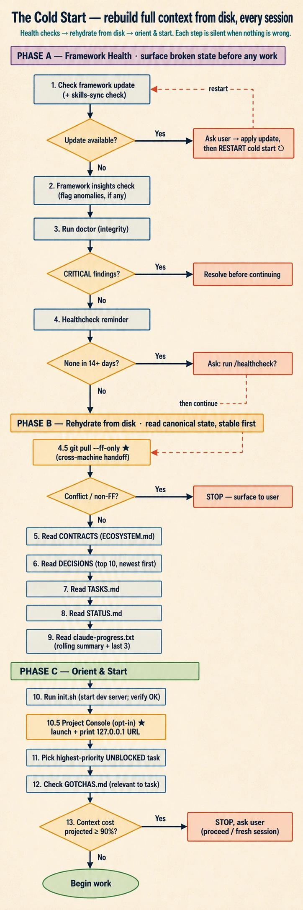
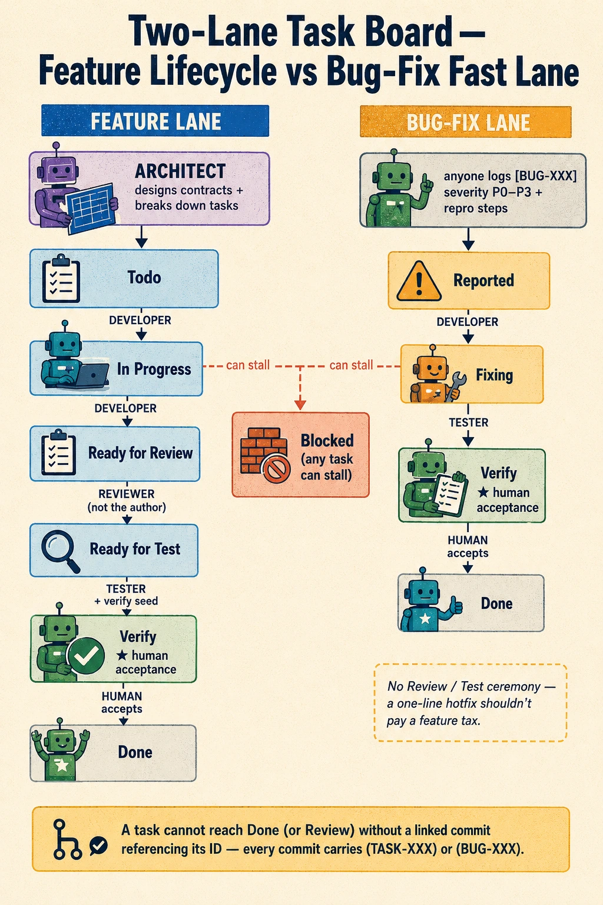
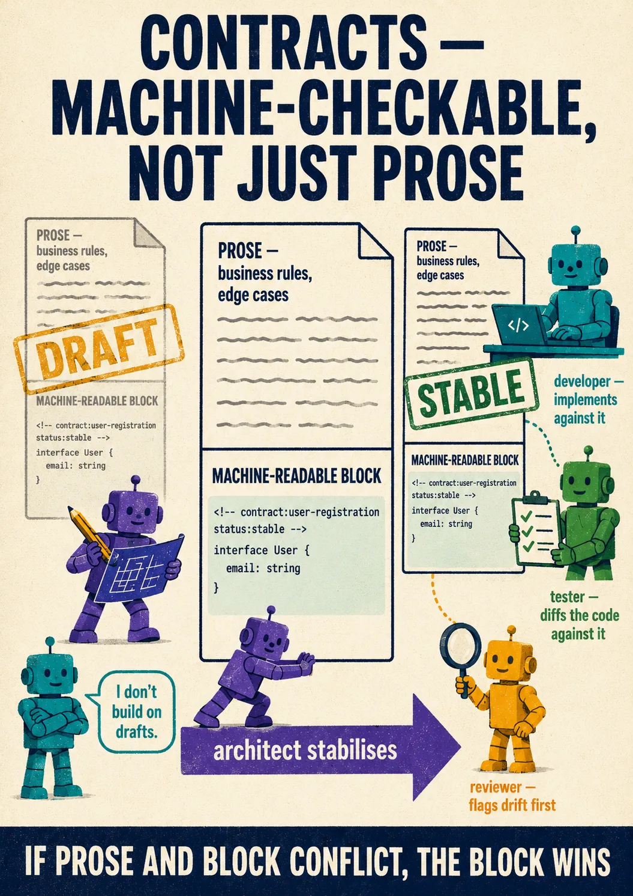
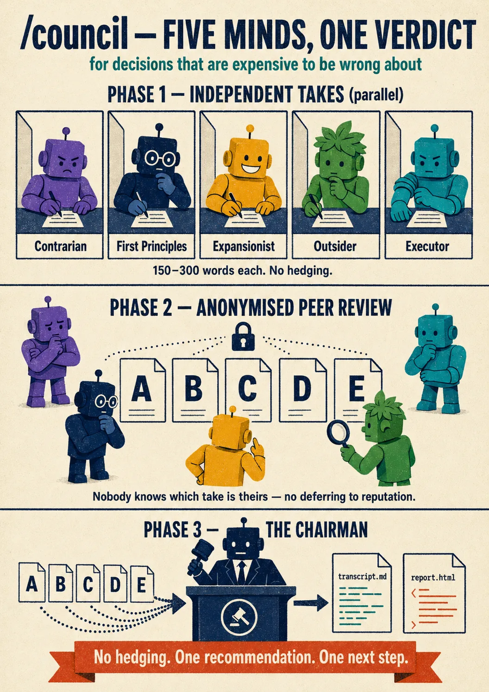
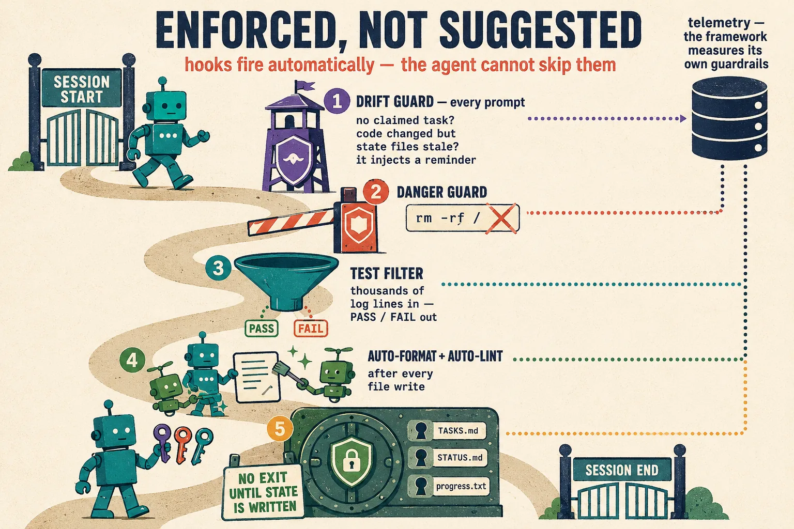
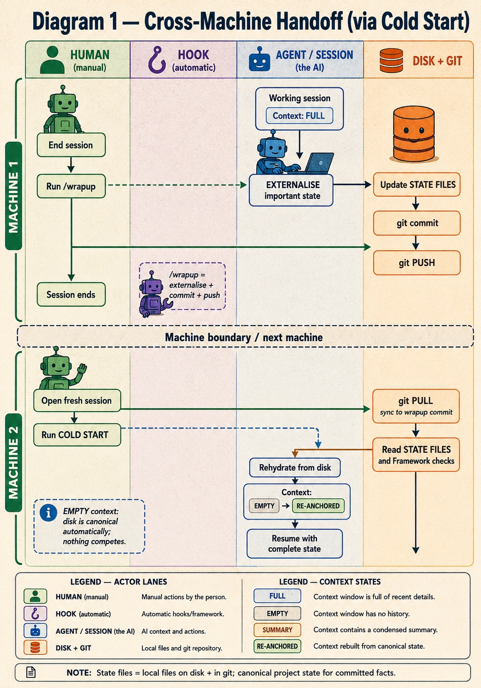
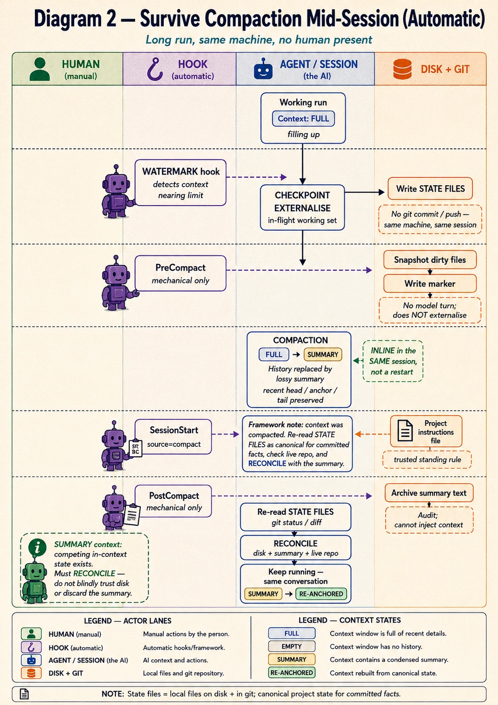
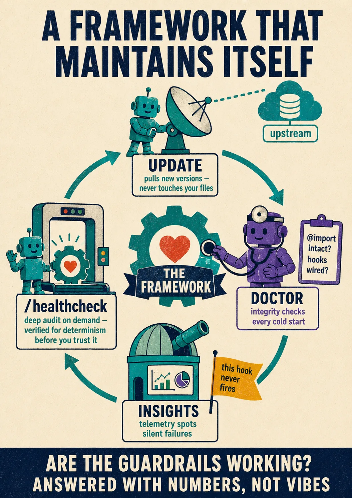

<div align="center">



# Claude Code Multi-Agent Framework (CCMAF)

**A disciplined operating system for agent-driven software projects.**
Roles, contracts, a persistent task board, session-lifecycle rules, a localhost
cockpit, and a library of senior-level skills — so an AI coding agent behaves
like a team that remembers, not a chat that forgets.

</div>

---

## What this is

Long-running work with a coding agent fails in predictable ways: context
evaporates between sessions, decisions get re-litigated, "done" is claimed
without verification, and two turns later the agent has forgotten the contract
it agreed to an hour ago.

CCMAF fixes that by putting the **source of truth on disk**, not in the volatile
context window. Every session cold-starts from the same state files, every
feature is one reviewable story, every contract is machine-readable, and a set
of hooks enforces the discipline so it doesn't rely on goodwill. The agent plays
defined **roles** (architect, developer, tester, reviewer, and a supporting cast
of verifier, researcher, designers, and a cross-module reconciler), hands off
through a two-lane **board**, and flushes its working memory to disk at every
session boundary.

It is designed for **Claude Code**, and works with any compatible agent runtime
that reads a `CLAUDE.md`.

## What's in this repo

This is a **consolidated** distribution — three components that are developed
separately but ship together:

| Component | Where | What it gives you |
| --------- | ----- | ----------------- |
| **Framework** | repo root + [`.claude/`](.claude/) | The agent roles, state files, two-lane board, hooks, slash commands, session-lifecycle rules, and self-update system. The core. |
| **Project Console** *(opt-in)* | npm: [`ccmaf-console`](https://www.npmjs.com/package/ccmaf-console) | A localhost cockpit that renders your `.claude/` state as a live UI — dashboard, kanban, the human-verify loop, contracts, decisions, docs — and writes your verdicts back as files the agents read next pass. Installed on demand (`npx`/global), not bundled here. |
| **Skills library** *(opt-in)* | [`drushegh/CCMAF---Skills`](https://github.com/drushegh/CCMAF---Skills) | Production-grade agent skills — one per technology domain (React, Rust, .NET, Kubernetes, Power Platform, …), each packaging the conventions, decision tables, and pitfalls a senior practitioner would enforce. Synced on demand from the public catalogue, not bundled here. |

You can adopt just the framework, or pull in the Console and any subset of skills.

---

## Quick start

```bash
# 1. Get the framework into your project
git clone https://github.com/drushegh/CCMAF.git
# (or copy the framework files into an existing project — see "Adopting into an existing project" below)

# 2. Point your project's CLAUDE.md at the framework instructions.
#    CLAUDE.md already imports CLAUDE.framework.md via the pointer at its top —
#    fill in the project-specific sections (tech stack, commands, domain rules).

# 3. Open the project in Claude Code and start a session.
#    The agent runs the Cold Start Sequence automatically (see CLAUDE.framework.md):
#    update check → doctor → read contracts/decisions/tasks/status → pick a task.
```

From there you work through **slash commands** (`/plan`, `/build`, `/test`,
`/review`, `/wrapup`, …) and the agent keeps the board and state files current.
The full operating manual is **[CLAUDE.framework.md](CLAUDE.framework.md)** — it
is the authoritative, framework-owned instruction set loaded into every session.

### Enabling the Console (recommended)

The Project Console — a localhost cockpit over your `.claude/` state — is opt-in but
**recommended**. Opt in and let the framework run it for you:

```bash
echo latest > .claude/.console-version   # opt in (content = an npm version spec)
node tools/console.mjs start             # resolves + runs the Console, prints the URL
```

The Console ships as the npm package [`ccmaf-console`](https://www.npmjs.com/package/ccmaf-console).
`console.mjs start` resolves it — a global install (`npm i -g ccmaf-console`) or `npx` — then
launches it, **starts the machine-global tray Hub if none is running**, and prints
`http://127.0.0.1:<port>`. On every cold start the framework brings it back up. It's
**localhost / personal use only** — no auth, no remote access.

### Adding skills (recommended)

The skills give the agent senior-level standards for your stack — **recommended**, not an
afterthought. At setup the agent detects your stack and offers a tiered choice
(**Base** — the skills that fit your stack / **Enhanced** — Base plus high-value
cross-cutting skills like `read-the-damn-docs` and `secure-development` / **All** /
**None**), then syncs your pick from the public
[CCMAF---Skills](https://github.com/drushegh/CCMAF---Skills) catalogue into `.claude/skills/`:

```bash
bash .claude/framework/update/skills-check.sh --suggest   # what matches your stack
# put your choice in .claude/.skills-version (SKILLS_SELECTED="..."), then:
bash .claude/framework/update/skills-sync.sh              # fetches them from the public catalogue
```

Each skill is self-contained and triggers automatically on the file types and keywords in
its frontmatter. The full catalogue lives in the public
[CCMAF---Skills](https://github.com/drushegh/CCMAF---Skills) repo (also installable as a Claude
Code plugin).

---

## How it works

### The cold start — disk is the source of truth



Every session begins by rebuilding context from disk: check for framework
updates, run the doctor, read the **contracts**, **decisions**, **task board**,
and **status**, then pick the highest-priority unblocked task. Nothing important
lives only in the chat — so a fresh window, a new machine, or a context
compaction never loses the thread.

### The board — one feature, one reviewable story



Work moves through two lanes with explicit lifecycle stages:

- **Feature lane:** `Todo → In Progress → Ready for Review → Ready for Test → Verify → Done`
- **Bug-fix lane:** `Reported → Fixing → Verify → Done`

`Verify` is the human-acceptance stage. The rule is **one board task per user
story** — never bundle features — so each one becomes its own per-feature
acceptance story the human can sign off independently. Every commit carries its
`TASK-XXX` / `BUG-XXX` ID; a task can't reach Done without a linked commit.

### Contracts — agreements that don't drift



Interfaces, types, and boundaries live in [`.claude/ECOSYSTEM.md`](.claude/ECOSYSTEM.md)
as both prose and **machine-readable fenced blocks** anchored with
`<!-- contract:ID status:stable -->`. If the agent changes a contract, it updates
the ecosystem doc *first* — and if it discovers a mismatch, it stops and flags it
rather than papering over it.

### Roles — the writer doesn't grade its own work

The agent operates as a **team of specialists**, and the separation is enforced —
the throughline is that **the agent that produces a claim never grades it**:

| Role | Does | Never does |
| ---- | ---- | ---------- |
| **Architect** | Plans, defines contracts, makes tech choices | Writes production code |
| **Developer** | Implements features and fixes | Reviews its own code |
| **Tester** | Validates against contracts, writes tests, emits verify-handback seeds | Writes production code |
| **Reviewer** | Contract compliance, security, quality | Modifies files |
| **Verifier** | Adversarially confirms or refutes another agent's claims before they're acted on | Grades a claim it produced |
| **Researcher** | Gathers cited evidence — external docs/APIs + internal git archaeology | Modifies files |
| **UI-designer** | Builds user-facing UI from explicit design tokens | Ships unrendered work as "done" |
| **UX-critic** | Adversarial UX + visual critique — cognitive walkthroughs, scored rubric | Modifies files |
| **Reconciler** | Audits *across* modules for duplicate / seam / contract / convention drift | Runs in the inner build loop, or fixes files |

The first four are the build-loop roles; the rest step in when the work calls for
it — and every skill pack a role needs is loaded on handoff, so the agent brings
senior-level standards to the task, not just the model's priors.

For genuinely hard decisions there's a **[/council](.claude/commands/council.md)** —
a panel of independent advisors (contrarian, first-principles, executor,
expansionist, outsider) plus peer review, synthesised into one verdict.



### External advisors & watcher mode *(optional)*

Some decisions are worth a second brain from *outside* the current agent. The
framework can escalate to an external model — with the integrity guarantee that
you always know which model actually answered.

- **Advisory consults.** [`/fable`](.claude/commands/fable.md) asks a Claude
  **Fable** sub-model; [`/sol`](.claude/commands/sol.md) ·
  [`/terra`](.claude/commands/terra.md) · [`/luna`](.claude/commands/luna.md) ask
  OpenAI's **GPT-5.6** through *your own* codex CLI and ChatGPT subscription.
  Every consult runs on a **fresh spawn** and is **transcript/attestation-verified**
  — a model's own "which model are you?" is never trusted — and is strictly
  **advisory**: it critiques and designs, it never touches your code or state.
  [`/consult`](.claude/commands/consult.md) runs several advisors over one
  identical brief and compiles an **extractive divergence map** (disagreements
  first, attributed, each seat verified before a word of it is read).
- **Watcher mode.** [`/mode`](.claude/commands/mode.md) switches on a
  `watcher-{low,medium,high}` tier where an open model **augments — never
  replaces —** the Claude reviewer and verifier: a different-provider cross-check
  on the same evidence, where the Claude verdict still governs what moves on the
  board.

These lanes are **opt-in and bring-your-own-model** — they need your own codex
CLI and ChatGPT subscription (and access to the Fable model). The framework's
full workflow runs without any of them.

### Hooks — discipline that doesn't depend on goodwill



Shipped hooks guard the workflow: a destructive-command blocker, state-file
enforcement (you can't end a session without updating the board, status, and
progress log), format/lint dispatch, dependency-registry checks, compaction
nudges, and the session-lifecycle hooks below. They're tunable by
**profile** (`minimal` / `standard` / `strict`) and per-hook opt-outs — see the
"Hook Configuration" section of [CLAUDE.framework.md](CLAUDE.framework.md).

> **The destructive-command blocker is defense-in-depth, not a security
> boundary.** It heuristically matches a command's *structure* (the program
> actually being run, and its arguments) against a short, deliberately small
> table of known-catastrophic shapes — a recursive-force delete aimed at a
> filesystem/drive root or the home directory, a low-level disk writer or
> formatter aimed at a whole block device, a fork bomb. It holds no
> exhaustive catalogue of bad commands and can be defeated by deliberate
> obfuscation (routing the destructive call through another interpreter,
> variable indirection, command substitution) — see the module docstring in
> `.claude/hooks/block-dangerous-commands.py` for the full design rationale.
> It also needs a working Python (`python3` or `python` actually resolving
> **and executing** on `PATH` — not just present) to run at all; if neither
> does, the guard is inert, and Claude Code warns loudly about that at
> session start instead of silently doing nothing. Treat it as a safety net
> for the obvious case, never as a substitute for backups, real permission
> configuration, or running risky work in a sandbox.

### Session lifecycle — never leave anything in the volatile layer



Four named moments keep disk close to working memory:

- **Checkpoint** *(mid-run)* — flush the in-flight working-set to a `## WIP` block.
- **Handoff** *(`/wrapup`)* — externalise everything, commit, and **push**. No push, no handoff.
- **Rehydrate** *(cold start)* — empty window; rebuild entirely from disk.
- **Re-anchor / Reconcile** *(after a compaction)* — treat the lossy summary as a hypothesis; trust the files and the live repo where they disagree.



---

## Slash commands

| Command | Purpose |
| ------- | ------- |
| [`/analyse`](.claude/commands/analyse.md) | Turn a request into a spec |
| [`/plan`](.claude/commands/plan.md) | Spec → tasks + contracts (one task per feature) |
| [`/build`](.claude/commands/build.md) | Implement a task end-to-end |
| [`/test`](.claude/commands/test.md) | Validate against contracts; emit verify-handback seeds |
| [`/review`](.claude/commands/review.md) | Contract / security / quality review |
| [`/reconcile`](.claude/commands/reconcile.md) | Horizontal reconciliation — duplicate/seam/contract/convention drift; scoped default, `--advisory` / `--full` |
| [`/board-heal`](.claude/commands/board-heal.md) | Reconcile the board with demonstrable reality (batch-build drift, orphan verify seeds, suffixed IDs) |
| [`/bug`](.claude/commands/bug.md) | Log and triage a bug |
| [`/security`](.claude/commands/security.md) | Security + config-surface audit |
| [`/council`](.claude/commands/council.md) | Multi-advisor decision panel (internal Claude sub-personas) |
| [`/fable`](.claude/commands/fable.md) | Advisory design/architecture second opinion from a Claude **Fable** sub-model (fresh-spawn + transcript-verified, advisory-only) |
| [`/sol`](.claude/commands/sol.md) · [`/terra`](.claude/commands/terra.md) · [`/luna`](.claude/commands/luna.md) | Advisory consults from OpenAI **GPT-5.6**, via *your own* codex CLI + ChatGPT subscription |
| [`/consult`](.claude/commands/consult.md) | Run several advisors over one identical brief → extractive divergence map |
| [`/mode`](.claude/commands/mode.md) | Switch **watcher mode** — an open model augments the Claude reviewer/verifier |
| [`/healthcheck`](.claude/commands/healthcheck.md) | Deep framework + project audit |
| [`/housekeeping`](.claude/commands/housekeeping.md) | Archive and distil aging state |
| [`/pre-compact`](.claude/commands/pre-compact.md) · [`/post-compact`](.claude/commands/post-compact.md) | Manual-compaction flush + rehydrate |
| [`/wrapup`](.claude/commands/wrapup.md) | Session handoff: externalise → commit → push |

---

## Repository layout

```
CCMAF/
├── CLAUDE.md                  # your project file (imports the framework instructions)
├── CLAUDE.framework.md        # the authoritative framework operating manual
├── .claude/
│   ├── TASKS.md STATUS.md DECISIONS.md ECOSYSTEM.md GOTCHAS.md   # the state files
│   ├── claude-progress.txt    # rolling summary + session log
│   ├── agents/                # role + council agent definitions
│   ├── commands/              # the slash commands
│   ├── hooks/                 # the enforcement + lifecycle hooks
│   ├── framework/             # update system, doctor, tests, agent docs, specs
│   └── skills/                # where your selected skills land
├── 01_Project/                # your application code lives here
├── docs/                      # supplementary docs the Console surfaces
└── tools/                     # the Console launcher driver (resolves the npm package)
```

## Keeping up to date

Once, after installing, bootstrap the upstream pin:

```bash
bash .claude/framework/update/init-framework-version.sh
```

This records where to pull framework updates from (this repo) in
`.claude/.framework-version`. After that the framework self-updates: every cold
start checks the pin and, if you're behind, summarises the new commits and asks
before applying. Updates are additive and safe — state files are never overwritten,
and new hook registrations are merged into your `settings.json` rather than
clobbering it.

**On `.github/` (CI workflows):** the workflows you get by cloning (CI, CodeQL,
Dependabot, PR-close) are **not** part of framework self-updates — they're a
starting scaffold, frozen at clone time. They self-gate to stay safe in your own
project: **CodeQL runs only on public repos** (a private repo needs paid GitHub
Advanced Security, so the job skips instead of failing), and the PR-close
workflow acts only on the canonical mirror. Adjust or delete `.github/` to suit
your project.

---

## Using, contributing, and feedback

**This repository is a published mirror.** It is developed in private maintenance
repositories and republished here as clean releases.

- ✅ **Clone it, copy it, fork it, adapt it** — that's what it's for.
- 💬 **Feedback is very welcome** — open an [Issue](https://github.com/drushegh/CCMAF/issues)
  or a [Discussion](https://github.com/drushegh/CCMAF/discussions). Bug reports,
  ideas, and "this confused me" notes all help.
- 🚫 **Pull requests are not merged here.** All changes flow from the upstream
  maintenance repos, so inbound PRs against this mirror can't be accepted — but
  the idea behind one absolutely can. Please open an Issue describing it instead.

If you adopt the framework, your agents will record improvement ideas in your own
`.claude/FRAMEWORK-SUGGESTIONS.md`. That file is local to your project — to send
an idea back, paste it into an Issue here. (Nothing is ever transmitted
automatically; it's yours to share or keep.)

## License

[MIT](LICENSE). Use it freely.

---

<div align="center">
<sub>The framework maintains itself.  Disk is the source of truth.</sub>
</div>
