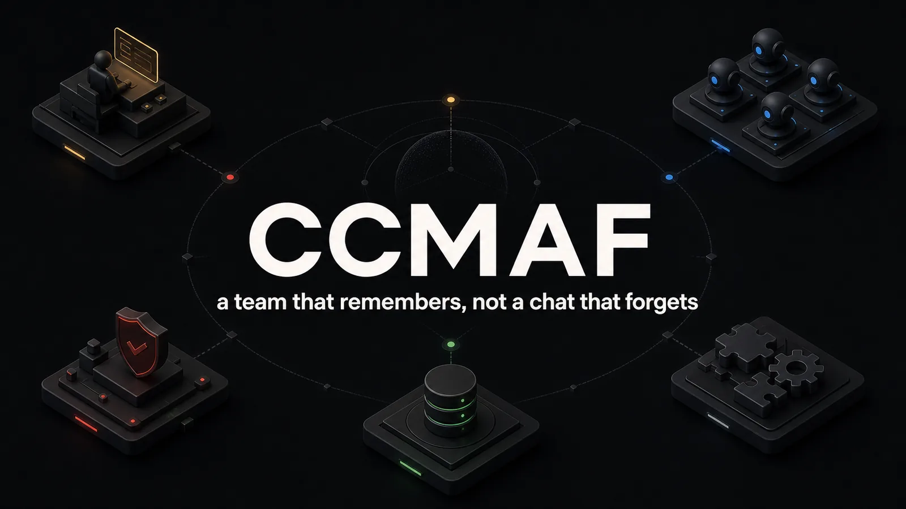

# CCMAF — Claude Code Multi-Agent Framework

**A team that remembers, not a chat that forgets.**

[](LICENSE)
[](https://www.npmjs.com/package/ccmaf-console)
[](https://github.com/drushegh/CCMAF---Skills)
[](https://docs.anthropic.com/en/docs/claude-code)

---

## Why this exists

Long agent-driven work fails in predictable ways. Context evaporates between sessions.
Decisions get re-litigated because nobody wrote down why. "Done" gets claimed without anyone
verifying it. Contracts agreed on Tuesday are forgotten by Thursday.

CCMAF answers each failure with a mechanism, not a resolution. The source of truth lives on
disk — a task board, a decision log, machine-readable contracts, a rolling progress file — and
hooks enforce the discipline so it does not depend on goodwill. It is built for Claude Code and
works with any agent runtime that reads a `CLAUDE.md`.

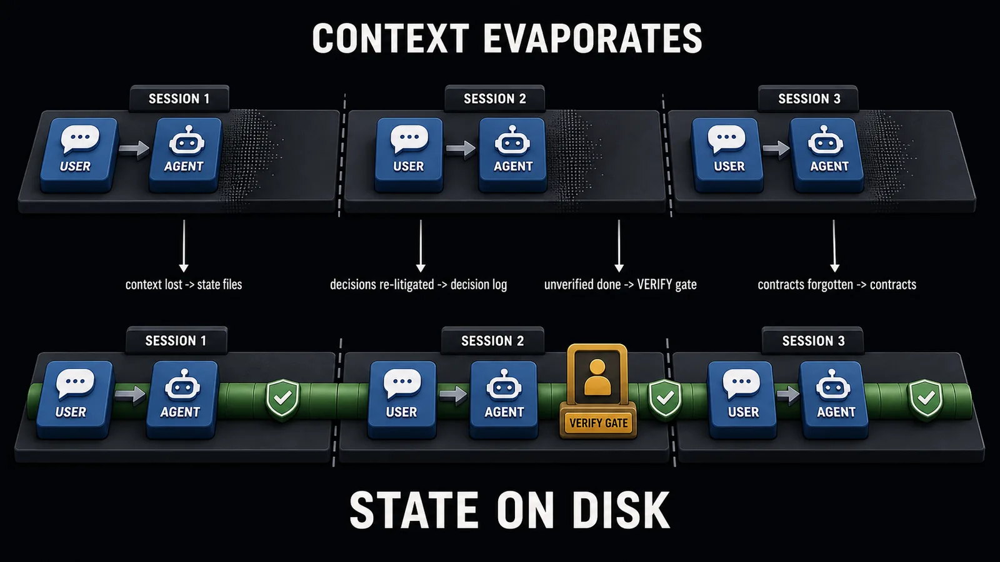
*Every failure mode of long agent work has a named mechanism on disk that answers it.*

| CCMAF is | CCMAF is not |
|---|---|
| a discipline layer for long-running agent work | an agent runtime, a model, or a hosted service |
| state files on disk, enforced by hooks | memory kept inside the context window |
| built for Claude Code | locked to it — any runtime that reads `CLAUDE.md` works |
| a core plus opt-ins (Console, skills, advisors) | a bundle you must adopt whole |

## The system on one page

One map, one legend. Every region on the map is a part of this README with the same name;
the picture is the table of contents.

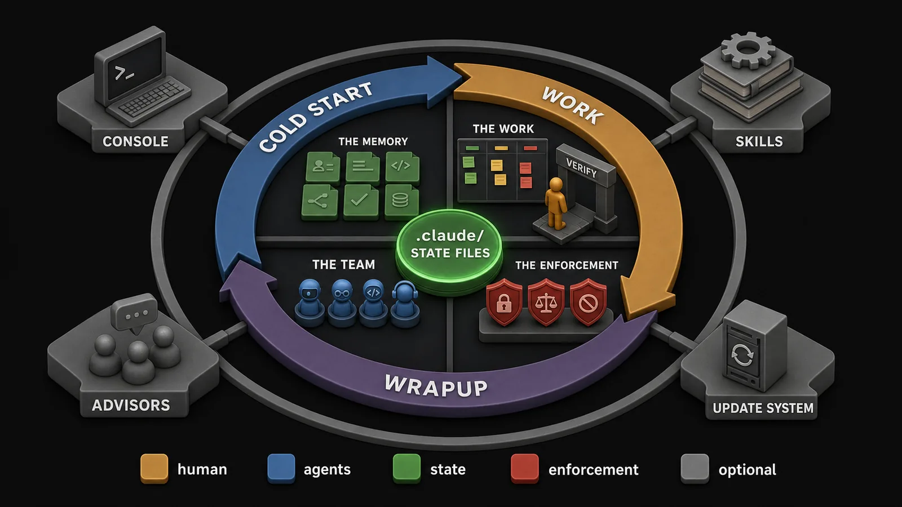
*The core is a loop around a disk; everything grey is optional and the loop runs without it.*

Colors mean the same thing in every diagram in this README:
**amber** — human authority · **blue** — agents · **green** — durable state on disk ·
**red** — enforcement · **grey** — opt-in systems.

> The first four sections tell you whether you want this. The rest is the complete map —
> every subsystem, one section each. Skim the diagrams and the bold lines; read the sections
> you'll use.

- [Part I — The loop](#part-i--the-loop) — one working session, and the commands that drive it
- [Part II — The memory](#part-ii--the-memory) — state files, the Cold Start Sequence, the session lifecycle
- [Part III — The work](#part-iii--the-work) — the two-lane board, the human Verify gate, contracts
- [Part IV — The team](#part-iv--the-team) — nine roles, the internal council, external advisors
- [Part V — The enforcement](#part-v--the-enforcement) — hooks, and the immune system that audits the framework itself
- [Part VI — The cockpit and the library](#part-vi--the-cockpit-and-the-library) — the Project Console and the skills library (both opt-in)
- [Part VII — Living with it](#part-vii--living-with-it) — self-updates, configuration, repository layout
- [Part VIII — The fine print](#part-viii--the-fine-print) — limits and non-goals, contributing, license

## What's in the repo

| Component | What it is | How it arrives |
|---|---|---|
| **Framework** (this repo) | state files, hooks, slash commands, role agents, doctor, update system | clone and copy into your project |
| **Project Console** | a localhost cockpit that renders your `.claude/` state as a live UI | opt-in; npm package [`ccmaf-console`](https://www.npmjs.com/package/ccmaf-console), fetched on demand |
| **Skills library** | per-domain engineering standards packs | opt-in; synced from the public [CCMAF---Skills](https://github.com/drushegh/CCMAF---Skills) catalogue |

Adopt just the framework. The other two are opt-in and arrive on demand; nothing in the core
loop depends on them.

## Quick start

```bash
# 1. Get the framework into your project
git clone https://github.com/drushegh/CCMAF
cp -r CCMAF/.claude CCMAF/CLAUDE.framework.md  your-project/

# 2. Point your project's CLAUDE.md at it (create the file if you don't have one).
#    First line:
#    @CLAUDE.framework.md

# 3. Open your-project in Claude Code.
#    The Cold Start Sequence runs itself: update check, doctor, state read, task pick.
```

**Console (opt-in)** — the localhost cockpit ([Part VI](#project-console-opt-in)):

```bash
echo latest > .claude/.console-version   # presence marks the opt-in; commit it
node tools/console.mjs start             # prints http://127.0.0.1:<port>
```

**Skills (opt-in)** — standards packs for your stack ([Part VI](#skills-library-opt-in)).
The cold start offers to set this up when your stack matches the catalogue; accepting creates
the `.claude/.skills-version` pin and runs the sync. By hand:

```bash
bash .claude/framework/update/skills-sync.sh   # syncs your selection into .claude/skills/
```

Recommended starting posture: the `standard` hook profile and the Base skills tier. Widen later.

*The authoritative operating manual is [`CLAUDE.framework.md`](CLAUDE.framework.md). This
README describes; that file instructs.*

---

## Part I — The loop

### One session, start to finish

You open the project in Claude Code. Before you type anything, the
[**Cold Start Sequence**](#the-cold-start-sequence) runs: the framework checks whether it is
behind upstream, the [**doctor**](#the-immune-system) validates the wiring — hooks registered,
contract anchors intact, board grammar clean — and a `git pull` picks up whatever a previous
session pushed, possibly from another machine. Then the session reads its memory off disk:
[contracts](#contracts-that-dont-drift), the last ten decisions, the
[**task board**](#the-two-lane-board), the status file, the rolling progress log. Nothing is
reconstructed from chat history, because none of it lives there.

The session picks the highest-priority unblocked task and you say
[**`/build`**](#the-verbs-slash-commands). The [**architect**](#nine-roles-separation-enforced)
confirms the contract. The **developer** implements — and never reviews its own work.
**`/review`** hands the diff to the **reviewer**, and a **verifier** with a fresh context
checks the findings before they move the board. **`/test`** validates the result against the
contract and emits a [**verify seed**](#verify-the-human-gate) — a small JSON file listing the
feature's use-cases, waiting for a human verdict.

An hour in, the context window is filling. The `checkpoint-watermark`
[hook](#hooks-discipline-without-goodwill) nudges; you flush the working set to a `## WIP`
block in the progress file. When an auto-compaction later rewrites the window into a summary,
that summary is treated as suspect: the session
[**reconciles**](#session-lifecycle-four-named-moments) — files are canonical for committed
facts, the summary only speaks for uncheckpointed in-flight work.

End of day: **`/wrapup`**. Everything important is externalised to the
[state files](#state-files-the-projects-memory-on-disk), committed with its task ID, and pushed.

**No push, no handoff.**

Tomorrow — same machine or a different one — the next session cold-starts, pulls, and rebuilds
the whole picture from disk. If you have opted into the [**Console**](#project-console-opt-in),
this afternoon's seed is waiting in the Verify column for your verdict, and whatever you decide
is written back as a file the agents read next pass.

Every bold noun in this story has its own section below. The rest of this README is
elaboration, not new plot.

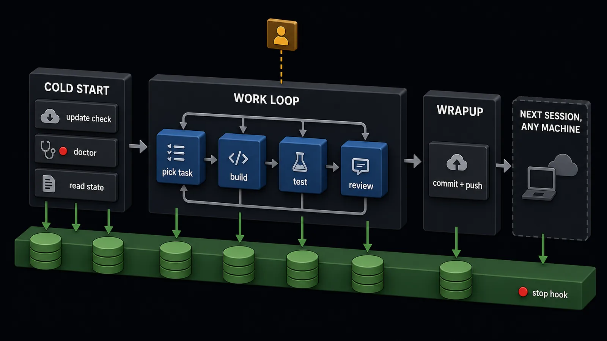
*The disk band never ends — sessions do. Everything important flows down before the window is lost.*

### The verbs: slash commands

Four families. Every later section links back here instead of re-listing its commands.

| Command | Purpose | Core / optional |
|---|---|---|
| **Build loop** | | |
| `/analyse` | turn a raw idea or requirement into an analysed spec | core |
| `/plan` | turn a spec into board tasks — one per user story — and contracts | core |
| `/build` | run the role loop over a task; UI work routes to the ui-designer | core |
| `/test` | validate against contracts, write tests, emit the verify seed | core |
| `/review` | reviewer verdict plus independent verification of the findings | core |
| **Quality & audit** | | |
| `/reconcile` | horizontal audit across modules — duplicates, seams, drift | core |
| `/board-heal` | repair board grammar and board-vs-reality coherence | core |
| `/bug` | log an ad-hoc bug straight onto the board from chat | core |
| `/security` | security sweep: SAST, secret scan, dependency audit | core |
| `/council` | internal five-persona panel with a chairman synthesis | core |
| `/healthcheck` | the periodic deep audit | core |
| `/housekeeping` | archive and distil aging state | core |
| **External advisors** | | |
| `/fable` | advisory consult — a Claude Fable sub-model, server-attested | optional |
| `/sol` `/terra` `/luna` | advisory consults — GPT-5.6 via your own codex CLI, client-attested | optional |
| `/consult` | several advisors, one identical brief, one divergence map | optional |
| `/mode` | show or switch which model family fills the watcher seats | optional |
| `/image` | labeled diagrams, infographics, or art via codex gpt-image | optional |
| **Session** | | |
| `/pre-compact` | deliberate checkpoint before a manual `/compact` | core |
| `/post-compact` | re-anchor and reconcile after a manual `/compact` | core |
| `/wrapup` | externalise, commit, push — end the session | core |

---

## Part II — The memory

### State files: the project's memory on disk

Seven files under `.claude/` are the project's memory. Each has one job, and the framework is
explicit about which updates are enforced and which are convention: the Stop hook will not let
a session end without updating the board, the status file, and the progress log. The decision
log and the contracts file are convention — no hook can judge whether a decision was made —
and the framework says so instead of pretending otherwise.

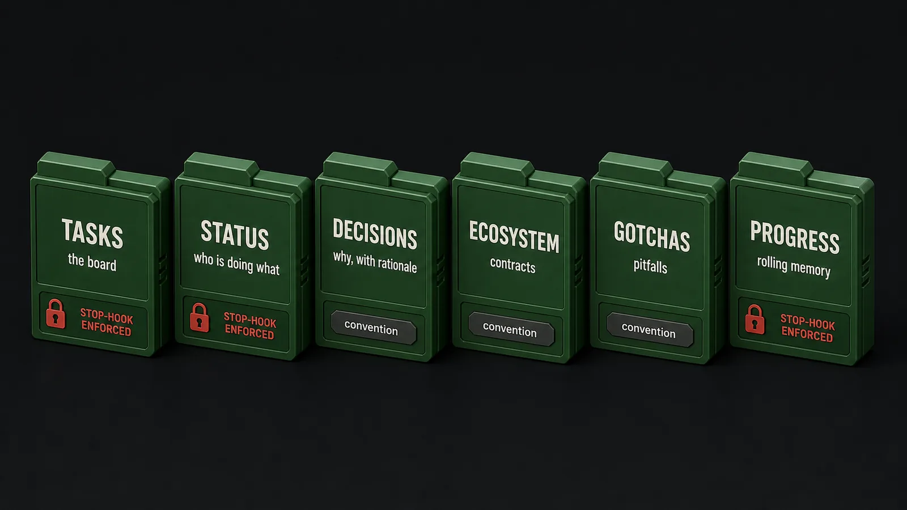
*Three of the seven files are enforced by a hook; the framework is honest that the other four rely on discipline.*

| File | Job | Written | Enforced by |
|---|---|---|---|
| `TASKS.md` | the board — two lanes, full lifecycle | on every status change | Stop hook |
| `STATUS.md` | who is doing what right now | session start and end | Stop hook |
| `claude-progress.txt` | rolling summary + recent sessions in detail | session end; `## WIP` checkpoints mid-run | Stop hook |
| `DECISIONS.md` | decisions with rationale, newest first | when a decision is made | convention |
| `ECOSYSTEM.md` | contracts — prose plus anchored machine-readable blocks | before the change that needs them | convention |
| `GOTCHAS.md` | pitfalls, by area | when one is hit | convention |
| `FRAMEWORK-SUGGESTIONS.md` | improvement ideas destined for upstream | as they surface | convention |

Real state beats described state. A decision entry:

```markdown
**2026-07-12 · TASK-214 · developer** — Sliding window over fixed window for the export
rate limit. Fixed windows allow a 2× burst at the boundary; the sliding counter costs one
extra Redis key per token. Considered: token bucket — more state, no added benefit at this scale.
```

And a mid-run checkpoint from `claude-progress.txt`, flushed before the window filled:

```markdown
## WIP
Task: TASK-214 (rate-limit the export endpoint)
Done: middleware + sliding-window counter; contract tightened to 30/min/token
Next: 429 retry-after header test; hand to tester
Decision in flight: per-token, not per-IP — IPs are shared behind the corp proxy
```

### The Cold Start Sequence

It runs unprompted at every session start. Phase by phase: check (is the framework behind
upstream? are opt-in surfaces suggesting themselves?), health (the doctor validates the wiring
before any work starts), sync (`git pull` picks up a handoff from another machine), read state
(contracts, then decisions, then the board, status, and progress), begin (init, then pick the
highest-priority unblocked task and check the gotchas for its area).

An empty window means disk is canonical — nothing competes with it.

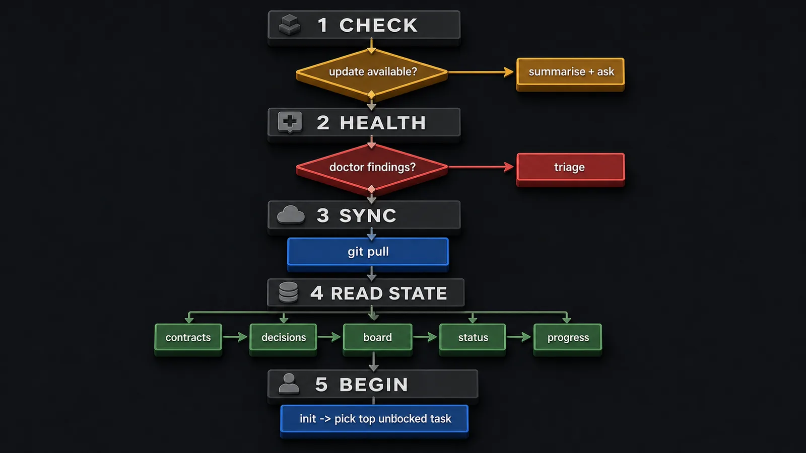
*Awareness before operation, health before work, rehydration before work selection.*

<details>
<summary>Every step, and why the order matters</summary>

The ordering is deliberate: update awareness precedes operation (you should know you're behind
before you act), health precedes work (broken wiring fails silently mid-session), rehydration
precedes work selection (you can't pick the right task off a stale board), and contracts
precede implementation (boundaries first, code second).

| # | Step | Why here |
|---|---|---|
| 1 | Framework update check | know you're behind before operating; summarises new commits and asks |
| 2 | Skills + Console checks | opt-in surfaces offer themselves; never forced, throttled |
| 3 | Insights check | transcript-mined suggestions surface before new work compounds them |
| 4 | Doctor | broken hooks, missing anchors, bad board grammar — caught before work starts |
| 5 | Healthcheck reminder | the deep audit has a cadence; this keeps it honest |
| 6 | `git pull` (rehydrate) | pick up a handoff pushed from another machine |
| 7 | Read contracts (`ECOSYSTEM.md`) | boundaries before implementation |
| 8 | Read decisions (top 10, newest first) | don't re-litigate what's settled |
| 9 | Read the board (`TASKS.md`) | what work exists, in which lifecycle stage |
| 10 | Read `STATUS.md` | who's doing what; claim your own work |
| 11 | Read the rolling progress log | how the last session actually ended |
| 12 | Run init | start the dev loop; verify nothing is broken |
| 13 | Pick the highest-priority unblocked task | work selection comes after rehydration, not before |
| 14 | Check `GOTCHAS.md` for the task area | known pitfalls before the first edit |

</details>

### Session lifecycle: four named moments

Disk is the source of truth; the job at every boundary is to make sure nothing important lives
only in the volatile window. The rule depends on what is in the window when you re-ground: an
empty window means disk is canonical automatically; a summary window means competing state
exists, so you reconcile — trusting neither side blindly.

| Moment | Trigger | Action | The rule |
|---|---|---|---|
| **Checkpoint** | mid-run, window filling | flush the working set to `## WIP` | flush before the window does it for you |
| **Handoff** | session end — `/wrapup` | externalise, commit, **push** | no push, no handoff |
| **Rehydrate** | cold start, empty window | rebuild entirely from disk | empty window: disk is canonical |
| **Re-anchor** | after a compaction, summary window | re-read files, `git diff`, reconcile | trust files over the summary for committed facts |

Two failure branches, stated plainly. Work committed but not pushed: the next machine
rehydrates a stale board — that is why the push is part of the definition of Handoff, not a
courtesy. Summary conflicts with files: files win for committed facts (decisions, contracts,
task lifecycle), but the summary is the only record of in-flight work since the last
checkpoint — so reconcile, never discard either side wholesale.

Manual compaction is the deliberate version of moments one and four: `/pre-compact` is a
checkpoint by intent, `/post-compact` is the explicit re-anchor after the window clears.

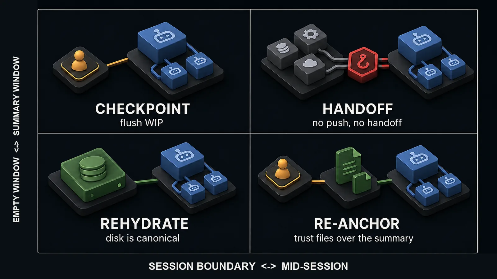
*What you do depends on what is in the window — empty means trust disk, summary means reconcile.*

---

## Part III — The work

### The two-lane board

`TASKS.md` has two lanes. Feature:
`Todo → In Progress → Ready for Review → Ready for Test → Verify → Done`. Bug-fix:
`Reported → Fixing → Verify → Done`. `Verify` is human acceptance — the stage where a person,
not an agent, signs off.

**One board task per user story. Never bundle features.**

That rule is what makes each feature its own reviewable acceptance story instead of a line
item inside an umbrella. Every commit carries its ID — `type: description (TASK-XXX)` or
`(BUG-XXX)` — and no task reaches Done without a linked commit. Board entries are
machine-read: the bracketed heading grammar and `**Field:**` markers below are parsed by
tooling and enforced by the doctor, not decoration.

```markdown
#### [TASK-214] Rate-limit the export endpoint
**Status:** Verify
**Priority:** P1
**Story:** As an API consumer, my export jobs are throttled predictably instead of failing under load.
**Commits:** feat: sliding-window rate limit on /api/export (TASK-214)
**Verify seed:** .claude/console/verify/TASK-214.json
```

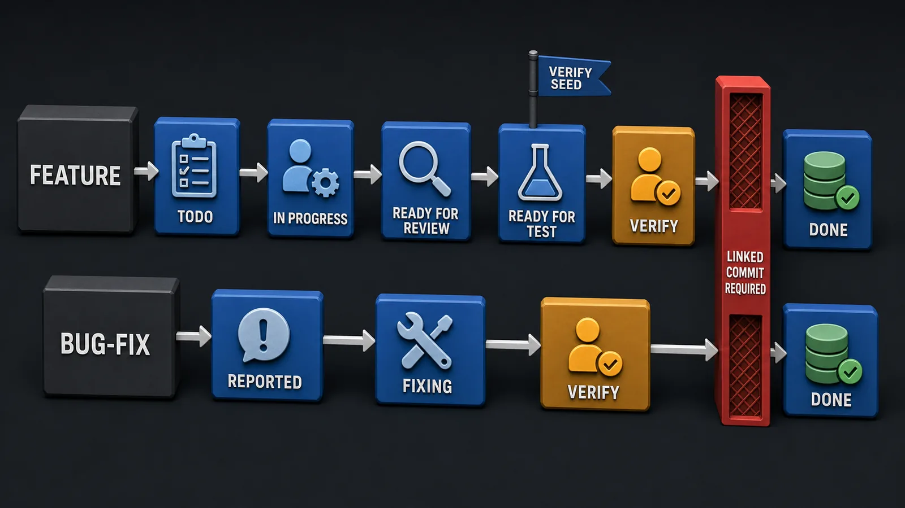
*Every gate has an owner — the reviewer opens Ready for Test, the tester opens Verify, and only a human opens Done.*

<details>
<summary>Who moves what, on what evidence</summary>

| Transition | Moved by | Evidence required |
|---|---|---|
| Todo → In Progress | developer (claims it) | `STATUS.md` updated |
| In Progress → Ready for Review | developer | linked commit with the task ID |
| Ready for Review → Ready for Test | reviewer — never the author | review findings clear; verifier confirms them |
| Ready for Test → Verify | tester | tests pass against the contract; verify seed emitted |
| Verify → Done | **human** | recorded verdict on the seed's items; linked commit exists |
| Reported → Fixing | developer | bug claimed in `STATUS.md` |
| Fixing → Verify | tester | fix committed with the bug ID and independently verified |
| Verify → Done | **human** | recorded verdict |

</details>

### Verify: the human gate

When a task reaches Ready for Test, the tester emits one verify-handback seed — a JSON file
per task under `.claude/console/verify/`, whose `items[]` are that feature's use-cases. The
human works through the items and records verdicts; passing moves the task to Done. Seeds are
write-once: a recorded human verdict is never clobbered. Emission is gated on
`.claude/console/` existing — absent, the tester skips it, so nothing in the core loop couples
to the Console.

```json
{
  "task": "TASK-214",
  "title": "Rate-limit the export endpoint",
  "emitted": "2026-07-14T16:42:07Z",
  "items": [
    { "id": 1, "case": "Exports under 30 req/min succeed unchanged", "verdict": null },
    { "id": 2, "case": "The 31st request in a minute returns 429 with retry_after_seconds", "verdict": null },
    { "id": 3, "case": "The limit is per token — a second token is unaffected", "verdict": null }
  ]
}
```

The retroactive rule covers batch and overnight builds: if many features were delivered under
one umbrella task, decompose after the fact — one board task per delivered feature, placed in
Verify, one seed each. Twenty features become twenty reviewable stories, not one unreviewable
pile. The [Console](#project-console-opt-in) renders this loop as a UI; the files alone are
enough without it.

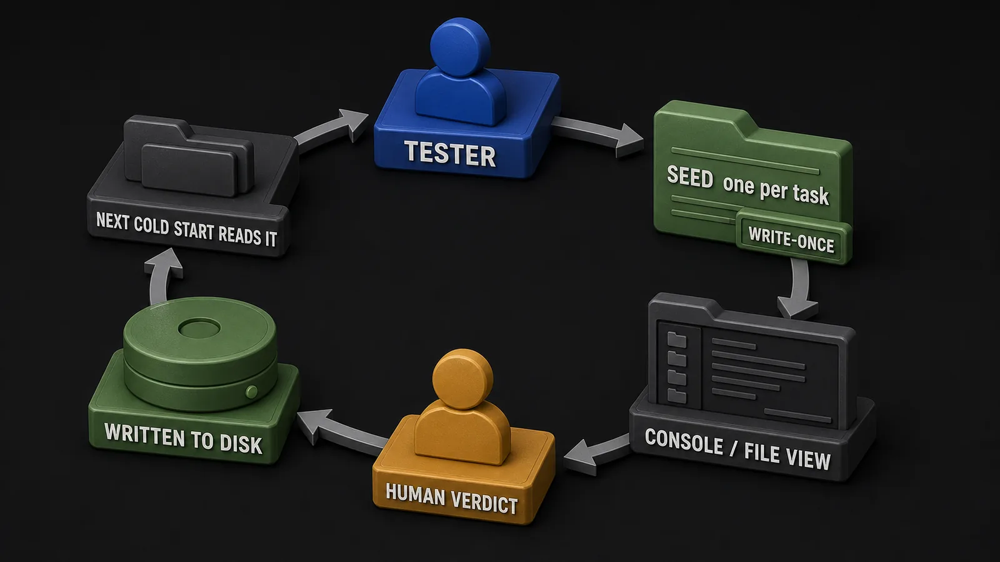
*The human verdict becomes a file, and files are what the agents read next pass — acceptance survives the session that asked for it.*

### Contracts that don't drift

Interfaces, types, and boundaries live in `ECOSYSTEM.md` twice over: as prose, and as
machine-readable fenced blocks anchored with an HTML comment. The anchor is what tooling and
the doctor find; the block is what agents diff their work against.

**Change the contract block first — then the code.**

**On a mismatch, stop and flag. Never paper over.**

Developers may tighten or clarify a contract inline; widening one escalates to the architect.
A real anchored block, as it appears in `ECOSYSTEM.md`:

````markdown
<!-- contract:export-api status:stable -->
```yaml
endpoint: POST /api/export
auth: bearer token, scope "export"
rate_limit: 30 requests / minute / token
responses:
  202: { job_id: string }              # accepted, job queued
  429: { retry_after_seconds: int }    # over the sliding-window limit
```
````

No diagram here on purpose. The excerpt proves what a picture of it could only assert: the
anchors exist, and they are grep-able.

---

## Part IV — The team

### Nine roles, separation enforced

Four roles form the build loop — architect, developer, tester, reviewer — and five support it.
Each is a separate agent with its own tools and its own prohibitions, because the failure the
role system exists to prevent is self-grading:

**The writer never grades its own work; the doer never verifies its own claim.**

| Role | Does | Never |
|---|---|---|
| **architect** | plans features, defines contracts and module structure | writes production code |
| **developer** | implements features and fixes | reviews its own code |
| **tester** | validates against contracts, writes tests, emits verify seeds | writes production code or fixes the bugs it finds |
| **reviewer** | contract, security, and quality review | edits files |
| **verifier** | adversarially confirms or refutes another agent's claims, always in a fresh context | verifies a claim it produced |
| **researcher** | gathers cited evidence — external docs, internal git archaeology | modifies files |
| **ui-designer** | builds user-facing UI from explicit design tokens | hands off unrendered work as done |
| **ux-critic** | cognitive walkthroughs and rubric-scored visual critique | modifies files |
| **reconciler** | horizontal audit across modules — duplicates, seams, contract and convention drift | runs inside the inner build loop; fixes what it finds |

Every role loads the behavioral principles and code conventions on handoff, and consults
installed [skills](#skills-library-opt-in) for its stack before working — when a skill covers
the task area, it outranks the model's priors.

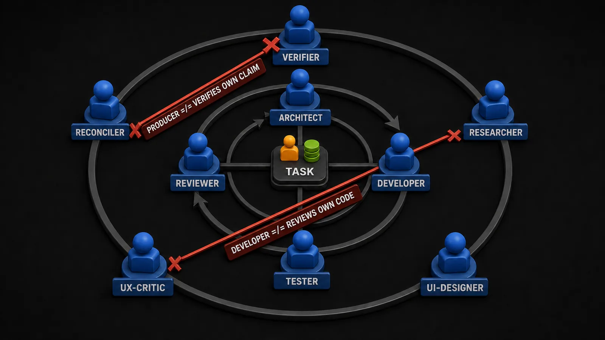
*The crossed edges are the design — separation is enforced by role boundaries, not requested by prompt.*

### /council: the internal panel

For decisions expensive to get wrong, `/council` convenes five sub-personas — contrarian,
first-principles, executor, expansionist, outsider — each of which takes the same question
from its own angle, peer-reviews the others, and hands the lot to a chairman for synthesis
into one verdict. It is deliberately internal: every seat is Claude. That is its limit as well
as its speed, and it is exactly why the next section exists.

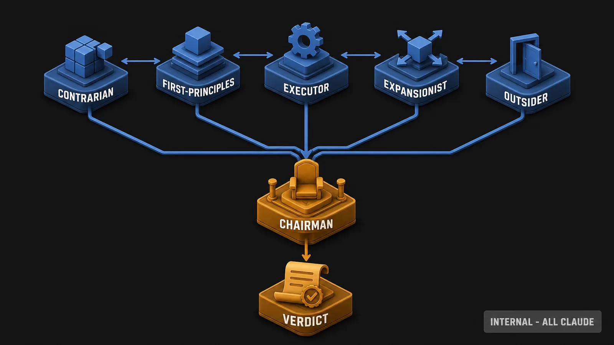
*Five angles, one synthesis — but every seat is the same model, which is the council's speed and its ceiling.*

### External advisors and watcher mode

The council's ceiling is that Claude reviews Claude. The advisor system breaks that ceiling by
buying second opinions from outside the model — on your own accounts, under strict rules.

`/fable` consults a Claude Fable sub-model, server-attested. `/sol`, `/terra`, and `/luna`
consult GPT-5.6 through your own codex CLI and ChatGPT subscription, client-attested.
`/consult` sends one identical brief to several seats and compiles an extractive divergence
map — disagreements first, every seat verified before a word of its answer is read. Three
rules hold for every consult: it is a fresh spawn, it is transcript- or attestation-verified,
and it is strictly advisory — an advisor never touches code or state.

> A model's own "which model are you?" is never trusted.

| Seat | Model | Runs via | Attestation |
|---|---|---|---|
| `/fable` | Claude Fable (sub-model) | your Claude Code session | server-attested |
| `/sol` | GPT-5.6 | your codex CLI + ChatGPT subscription | client-attested |
| `/terra` | GPT-5.6 | your codex CLI + ChatGPT subscription | client-attested |
| `/luna` | GPT-5.6 | your codex CLI + ChatGPT subscription | client-attested |

*Model–seat mapping verified for the framework release this README ships with (see footer);
`/mode` in your clone is always the live answer.*

**Watcher mode** (`/mode watcher-low|medium|high`) goes one step further: an open model
augments the reviewer and verifier seats as a different-provider cross-check.

**It augments, never replaces — the Claude verdict still governs the board.**

`/image` rides the same lane: raster generation via codex gpt-image (default seat terra,
overridable), producing labeled diagrams, infographics, or art as WebP. The labeled diagrams
in this README were generated with `/image`.

All of this is bring-your-own-model and opt-in. The entire core workflow runs without any of it.

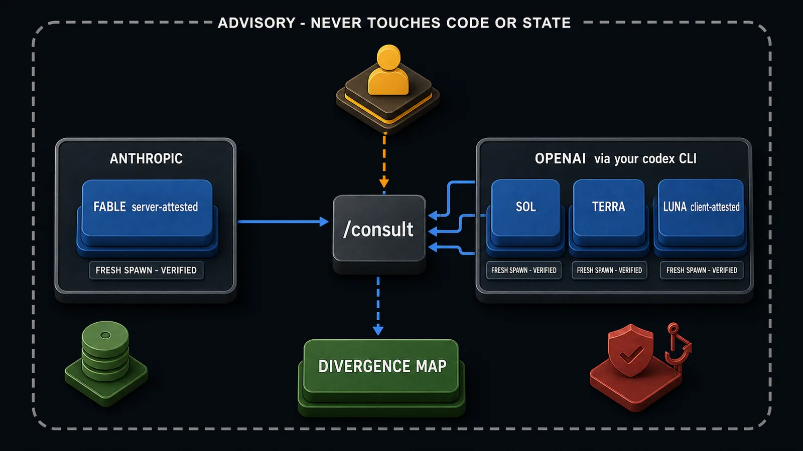
*Second opinions cross a provider boundary, but authority never does — advisors advise, and the Claude verdict governs.*

---

## Part V — The enforcement

### Hooks: discipline without goodwill

Everything above describes discipline; hooks are what make it not depend on anyone's mood.
They fire on session events — start, prompt, before and after each tool call, before
compaction, at stop — and the Stop hook is the reason a session cannot end with a stale board.
Hooks run under a profile: `minimal` keeps only the safety tier, `standard` runs everything
shipped (the default), `strict` reserves room for opt-in extras. Individual hooks can be
disabled by ID; an explicit disable always wins.

> The destructive-command guard (`block-dangerous`) is heuristic defense-in-depth, not a
> security boundary. It catches the accidents it was written for — an `rm -rf` at the wrong
> path, a force-push nobody asked for — and a determined actor or a novel phrasing will get
> past it. Treat it as a seatbelt, not a vault door.

The safety tier — the guard and its health monitor — survives even the `minimal` profile.

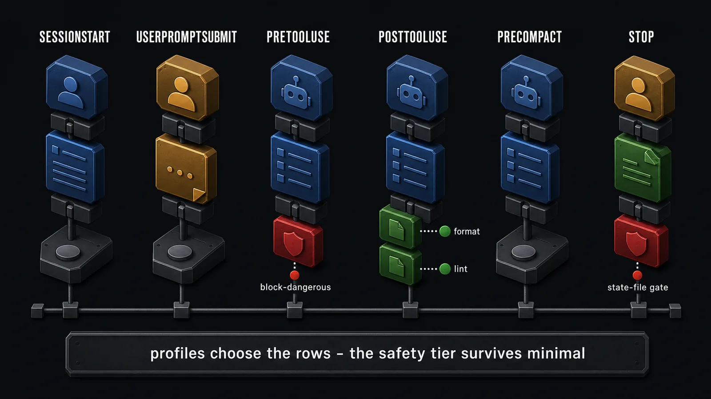
*Enforcement is positional — each hook guards one moment in the session, and the Stop column is why a session cannot end with a stale board.*

<details>
<summary>Every shipped hook</summary>

| Hook | What it does | Tier |
|---|---|---|
| `block-dangerous` | destructive-command guard (`rm -rf`, force-push, and kin) | safety |
| `guard-interpreter-check` | reports if the guard has lost its interpreter and is silently off | safety |
| `enforce-state` | blocks session end until `TASKS.md`, `STATUS.md`, and progress are updated | standard |
| `filter-test-output` | trims noisy test output before it floods the window | standard |
| `drift-guard` | flags divergence between claimed state and the working tree mid-session | standard |
| `format` | auto-format dispatch by detected stack | standard |
| `lint` | lint dispatch by detected stack | standard |
| `verify-deps` | checks requested packages against the registry before install | standard |
| `suggest-compact` | compaction nudge on a turn cadence | standard |
| `cost-tracker` | records cost and usage telemetry, locally | standard |
| `session-start-marker` | records HEAD at session start for later re-anchor and diff | standard |
| `checkpoint-watermark` | nudges a `## WIP` checkpoint as the window fills | standard |
| `precompact-snapshot` | snapshots working state before a compaction | standard |
| `reanchor` | injects the reconcile directive after an auto-compaction | standard |
| `postcompact-archive` | archives the pre-compact snapshot | standard |
| `console-heartbeat` | keeps the Console registry entry fresh; no-op unless opted in | standard |
| `console-autostart` | brings an opted-in project's Console up at session start | standard |

Tuning — profiles, per-hook disables, and the legacy opt-outs — is in the
[configuration reference](#configuration-reference).

</details>

### The immune system

The framework audits itself on three tiers. The doctor runs at every cold start and validates
the machinery: hook wiring, contract anchors, state-file grammar, manifest paths,
board-vs-reality coherence, state-size budgets. Findings come back as CRITICAL (resolve before
continuing — broken hooks fail silently), WARNING (triage), or NAG (an advisory nudge, such as
a reconcile-cadence reminder). `/healthcheck` is the periodic deep audit across framework
integrity, code quality, contracts, and state. `/housekeeping` archives and distils aging
state so the memory stays readable.

| Tier | Cadence | Scope |
|---|---|---|
| doctor | every cold start | is the machinery intact? |
| `/healthcheck` | periodic (nudged after N days) | is the whole project healthy? |
| `/housekeeping` | on demand | is the memory still lean? |

Two quieter organs feed the loop. Framework-insights mines the session transcript for
corrections and standing directives you keep repeating, and turns them into suggestions.
Telemetry records hook events, cost, and session efficacy — local files only; nothing leaves
the machine.

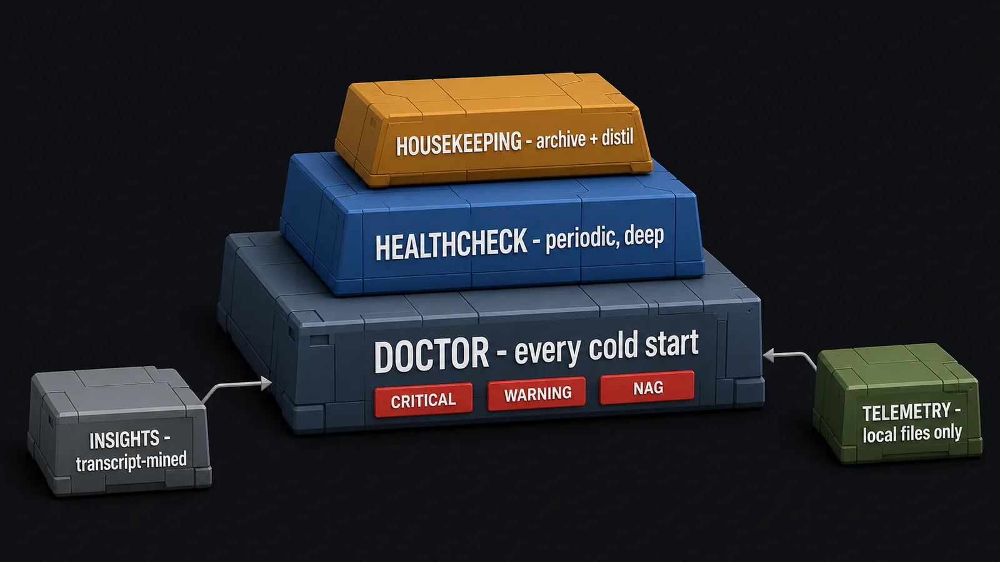
*The framework checks its own wiring before it checks your code — every cold start, not once a quarter.*

---

## Part VI — The cockpit and the library

### Project Console (opt-in)

The Console is a localhost cockpit over your `.claude/` state — it runs on `127.0.0.1`, for
one person, with no auth, and is not a multi-user or hosted tool. It renders the board as a
kanban, the dashboard, contracts, decisions, and the `docs/` tree as a live UI, and it is the
comfortable way to work the [Verify loop](#verify-the-human-gate): your verdicts are written
back as files the agents read next pass. A machine-global tray Hub gives a fleet view across
every opted-in project on the machine.

It ships as the npm package `ccmaf-console`, fetched on demand — it is not bundled with the
framework. Opt in with the two lines in [Quick start](#quick-start); two lifecycle hooks keep
a running Console fresh while you work and bring it up on cold boot.

<!-- SHOT: real Console screenshot needed — never generate -->
*Screenshot pending: the Console dashboard and kanban over a live project's `.claude/` state.*

<!-- SHOT: real Console screenshot needed — never generate -->
*Screenshot pending: the Verify flow — a seed's use-case items awaiting human verdicts.*

### Skills library (opt-in)

Skills are per-domain standards packs — senior-level engineering conventions for React, Rust,
.NET, Kubernetes, Power Platform, and other stacks — maintained in the public
[CCMAF---Skills](https://github.com/drushegh/CCMAF---Skills) catalogue and synced into
`.claude/skills/`. Setup is a tiered choice: Base, Enhanced, All, or None. Once installed,
skills auto-trigger on file types and keywords declared in each skill's frontmatter, and every
role agent consults the relevant ones before working.

**When a skill covers the task area, it outranks the model's priors.**

Absent skills are a silent no-op, never an error — the framework runs identically with none
installed.

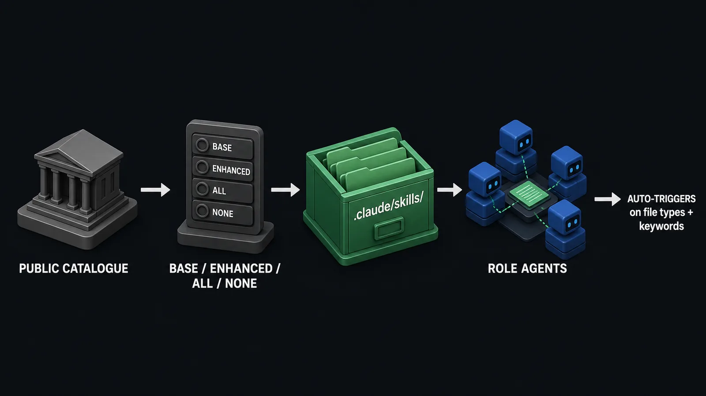
*Standards arrive as files and load themselves when the work matches — no skill installed, nothing lost.*

---

## Part VII — Living with it

### Self-updating, additively

Your project pins the framework with a `.framework-version` file. Every cold start checks the
pin against upstream; if you are behind, the session summarises the new commits and asks
before applying anything. Updates are additive by design: the framework replaces only its own
manifest-listed files, merges new hook registrations into your `settings.json` instead of
clobbering it, and names any collision with a file you customised loudly rather than silently
overwriting your intent.

| On update | What happens |
|---|---|
| framework-owned files (hooks, commands, agents, `CLAUDE.framework.md`) | replaced with upstream's; collisions with local edits named loudly |
| `settings.json` hook registrations | merged — consumer-owned settings survive |
| your state files, your `CLAUDE.md` | never touched |
| `.github/` CI scaffold | not managed — a frozen starting point; CodeQL self-gates to skip on private repos |

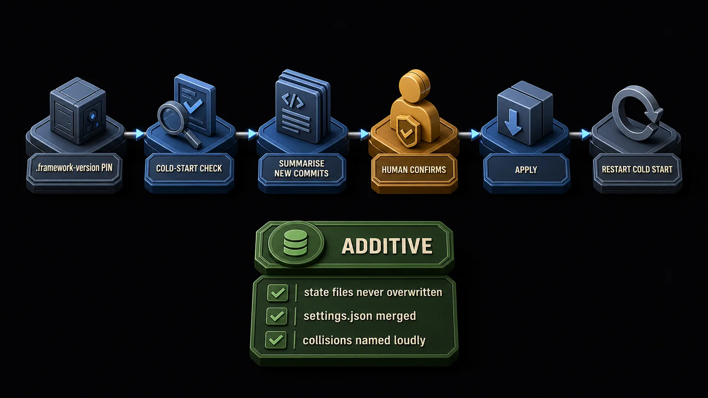
*The update system asks first and replaces only what it owns — your memory and your settings are not its to touch.*

### Configuration reference

Everything in this section is consumer-owned and survives updates. The defaults are the
recommendation; open a fold when you want a knob.

<details>
<summary>Hook profiles and environment variables</summary>

- `CLAUDE_HOOK_PROFILE=minimal|standard|strict` — `minimal` keeps only the safety tier;
  `standard` (default) runs everything shipped; `strict` adds any hooks declared at the
  strict tier.
- `CLAUDE_DISABLED_HOOKS="format,lint"` — disable hooks by stable ID regardless of profile.
  An explicit disable always wins, even for safety-tier hooks.
- Legacy per-hook opt-outs compose with the above: `CLAUDE_DEP_VERIFY=0` (skip registry
  checks), `CLAUDE_DOTNET_FORMAT=1` / `CLAUDE_DOTNET_LINT=1` (opt into slow .NET tooling),
  `CLAUDE_SUGGEST_COMPACT_TURNS=N` (compaction-nudge cadence).
- Session-lifecycle knobs: `CLAUDE_CONTEXT_WINDOW_TOKENS=N` (window size for the watermark
  estimate; set `1000000` on a 1M-context session or the checkpoint nudge fires immediately)
  and `CLAUDE_CHECKPOINT_WATERMARK_PCT=N` (nudge threshold, default 75).

</details>

<details>
<summary>Permission gating</summary>

`settings.json` already denies reads and writes of secret paths, and the destructive-command
guard covers the accident tier. To require an interactive confirm before a specific
risky-but-allowed operation, add an `ask` array to `permissions` alongside `allow`/`deny`:

```json
"permissions": {
  "ask": [
    "Bash(git push --force:*)",
    "Bash(rm -rf:*)",
    "Edit(**/migrations/**)"
  ]
}
```

The exact matcher forms are Claude Code-version-specific — confirm against the permissions
documentation for your version before relying on them. Prefer this harness-native matrix over
a bespoke gate hook, which would duplicate the permission engine for marginal gain.

</details>

<details>
<summary>MCP guidance</summary>

Only enable servers you are actively using — each carries a token cost per session. Prefer CLI
tools over MCP when both exist; the CLI is almost always cheaper.

</details>

<details>
<summary>Behavioral principles and code conventions</summary>

Two documents every role agent loads on handoff: the behavioral principles (per-turn
discipline — think before coding, simplicity first, surgical changes) and the code conventions
(check for existing helpers before creating, reuse over duplication, domain language from
`ECOSYSTEM.md`). Both live under `.claude/framework/agent_docs/` and are framework-owned.

</details>

### Repository layout

```text
your-project/
├── CLAUDE.md                     # yours — first line points at CLAUDE.framework.md
├── CLAUDE.framework.md           # framework-owned operating manual (overwritten on update)
├── .claude/
│   ├── TASKS.md                  # the board                    ┐
│   ├── STATUS.md                 # who's doing what             ├─ your memory —
│   ├── DECISIONS.md              # why, with rationale          │  never overwritten
│   ├── ECOSYSTEM.md              # contracts, anchored          │  by updates
│   ├── GOTCHAS.md                # pitfalls                     │
│   ├── claude-progress.txt       # rolling summary + WIP        ┘
│   ├── FRAMEWORK-SUGGESTIONS.md  # feedback destined for upstream
│   ├── settings.json             # consumer-owned; hook registrations merged in
│   ├── hooks/                    # enforcement hooks (framework-owned)
│   ├── commands/                 # the slash commands
│   ├── agents/                   # the nine role definitions
│   ├── skills/                   # opt-in, synced from the catalogue
│   └── framework/                # update system, doctor, insights, tests, agent docs
├── tools/
│   └── console.mjs               # Console driver — resolves the npm package
└── .github/                      # frozen CI scaffold: CodeQL, Dependabot (self-gating)
```

---

## Part VIII — The fine print

### Limits and non-goals

Stated in the same voice as the features, because they are part of the same design.

- The destructive-command guard is heuristic defense-in-depth, not a security boundary. It
  stops accidents; it will not stop a determined actor or a sufficiently novel phrasing.
- Only three state files are hook-enforced. The decision log and contract discipline are
  convention — no hook can judge whether a decision was made. The framework narrows the gap
  between instruction and behavior; it does not close it.
- Anything a hook cannot check still relies on the model actually following its instructions.
  That reliance is smaller here than in an unstructured setup, and it is not zero.
- The Console is localhost, single-user, no auth. It is a personal cockpit, not a team
  deployment target.
- External advisors and watcher mode need your own subscriptions (codex CLI, ChatGPT). The
  core workflow runs without them, and without the Console and skills too.
- CCMAF is not an agent runtime, a model, or a hosted service. It assumes Claude Code's hook
  and command surface; other runtimes get the state files and conventions, not the enforcement.

### Using, contributing, license

This public repository is a published mirror: the framework is developed privately and
republished here as clean releases. Pull requests are not merged on the mirror — an automated
workflow closes them — but Issues are read and welcome, for bugs and proposals alike. If you
adopt the framework, ideas you log in your own `FRAMEWORK-SUGGESTIONS.md` only help others if
they travel: file them as Issues here.

Licensed [MIT](LICENSE).

---

*README audited against the framework release of 2026-07. The labeled diagrams were generated
with `/image`; the Console images are real screenshots.*

**The framework maintains itself. Disk is the source of truth.**
